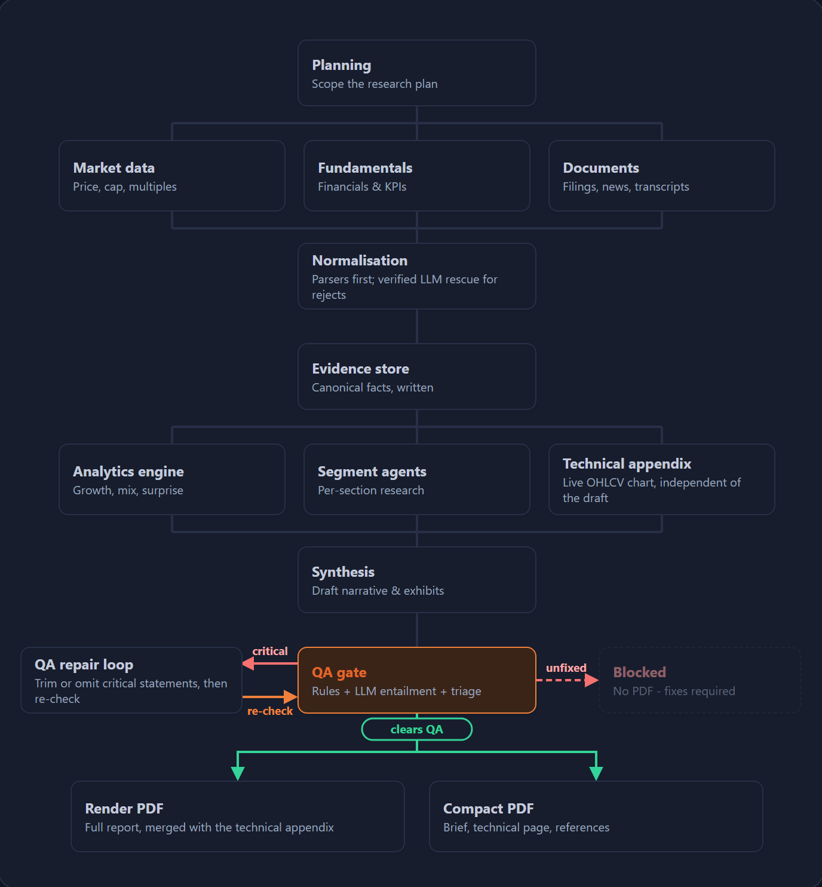

# EQR Research Report

An end-to-end, LLM-assisted equity research report generator. Give it a ticker and
it plans the research, pulls market, fundamentals and filings data, turns it into a
provenance-tracked evidence store, runs reproducible analytics, drafts a neutral and
fully cited report, checks every claim against its source, repairs what fails, and
renders PDFs. A local web UI runs it, shows progress live, and reports what QA found.

**Stack:** Python 3.11+, SQLite (Evidence Store), ReportLab (PDF), Flask (web UI),
OpenRouter (LLMs), MegadataAPI (data).

**What a run produces**

| Output | What it is |
|---|---|
| Full report PDF | The complete narrative report, with the technical appendix appended when market data allows |
| Compact report PDF | Page 1 brief, page 2 technical dashboard, page 3 the sources the brief cites |
| Report JSON + QA files | The structured report, every QA finding, and the repair log |
| Run manifest | Stage timings, LLM cost and tokens per stage, warnings and errors |

> The report is a neutral analysis, not investment research: no Buy/Hold/Sell view,
> no price target, and no claim that a valuation is justified or unjustified.

---

## 1. Quick start

```bash
pip install -r requirements.txt
cp .env.example .env        # then edit .env (see section 3)
python webui/app.py         # then open http://127.0.0.1:5050
```

You need two things in `.env`:

1. **`EQR_MODEL_API_KEY`**: an OpenRouter key. A run will not start without one.
2. **`EQR_MEGADATA_BASE_URL`** plus credentials (`EQR_MEGADATA_USERNAME` and
   `EQR_MEGADATA_PASSWORD`, or `EQR_MEGADATA_API_KEY`). MegadataAPI is the only data
   provider, and there is no mock or fallback data.

---

## 2. Using the web UI

Start it with `python webui/app.py` and open **http://127.0.0.1:5050**. Stop it with
`Ctrl+C` in the terminal. Jobs live in the server's memory, so restarting the server
clears the lists; the finished files stay on disk (see section 6).

There are two pages. The **home page** (`/`) is where you start a report. Pressing Generate takes you to
the **run page** (`/job/<id>`), which fits on one screen: 1 (the run) and 2 (the steps) on the left, 3 (the
report viewer) in the middle at full height, and the workflow map with 4 (QA review) below it on the right. The home page also lists
this session's recent runs, so you can get back to a run page; an old link after a server restart just
returns you to the home page.

**Generate a report** (home page)

1. **Enter a ticker**, for example `NVDA`, `AAPL` or `TSLA` (Enter also starts the run).
2. **Choose a model** in the *Model* dropdown. It lists curated OpenRouter models with
   live prices per 1M tokens. Your `.env` model is marked *(default)*. Pick
   *Custom model id…* to type any exact OpenRouter id (for example
   `openai/gpt-5.6-sol`); an id OpenRouter does not list is rejected. The chosen model
   is used for **every** LLM stage of that run. A stronger model writes better but costs
   more; the price line under the dropdown shows the trade-off.
3. Click **Generate Reports**. You are taken to the run page while the run continues. A run typically
   takes several minutes.
4. To cancel, click **Stop run** in card 1 of the run page. The run stops at its next step and is marked
   *Stopped*. A model call already in flight still finishes and is billed, but its result is discarded.
   **New report** in the same card takes you back to the home page.

**Watch it run**

- **Stat cards** at the top show elapsed time, LLM cost so far, tokens, and the model in use.
- **2. Generating Reports** is a five-step tracker with a timer on each step.
- **Workflow map** (bottom of the page) shows the real pipeline. Nodes turn green when
  done and pulse orange while running; each shows its time and, for LLM stages, its cost.
  The QA gate branches three ways: *critical* findings go to the repair loop, which sends
  a repaired draft back for a *re-check*; findings that stay *unfixed* lead to **Blocked**
  (no PDF); a draft that *clears QA* goes on to the two PDFs.

**Read the result**

- **3. Report Viewer** shows the finished report as a web page: sections, bullets, tables and
  charts. **Click any bullet** (or a section's opening line) and a panel slides in from the
  right showing where it comes from: the calculation with its formula and inputs, and each
  source with its publisher, date, the extracted figure or excerpt, confidence and a link to the
  original. Press Esc, click the dimmed page or the close button to dismiss it. The two buttons
  above the report, **Full report (PDF)** and **Compact report (PDF)**, download the PDFs. If QA
  blocked the run, the viewer says so and the buttons stay disabled.
- **4. QA review** fills in when QA finishes (including for blocked runs):
  - badges for critical, warnings, info and repaired counts;
  - **Critical findings** and **Warnings**: the check name, section, message, and the
    sentence it concerns;
  - **Info**: minor notes, collapsed by default;
  - **Repairs made during QA**: each statement that was rewritten or dropped, with the
    original and rewritten text;
  - **Pipeline notices**: run warnings and errors, for example a technical appendix that
    could not be built.

**Resume a previous run** (home page): click *Resume a previous run instead*, paste a run id such as
`run_20260929T060809_f9cebb` (the folder name under `output_webui/runs/`), and press
*Resume*. It re-runs analysis, synthesis, QA and rendering from that run's saved plan and
evidence, so there is no new planning or data acquisition. It is useful for retrying after
a QA block without re-fetching data.

**Tips**

- Compare models by running the same ticker twice with different choices and checking cost,
  time and the QA review.
- If a run fails immediately, the viewer shows the error. The most common causes are in
  section 8.

---

## 3. Configuration (`.env`)

The web UI loads `.env` automatically. Nothing outside `eq_report/config.py` reads the
environment, and credentials are never logged.

| Variable | Default | Purpose |
|---|---|---|
| `EQR_MODEL_API_KEY` | none | **Required.** OpenRouter key (or set `OPENROUTER_API_KEY`) |
| `EQR_MODEL_NAME` | `openai/gpt-5` | Default model for every LLM stage (the web UI can override it per run) |
| `EQR_MODEL_NAME_AGENTS` | unset | Optional separate, cheaper model for the segment agents only |
| `EQR_MODEL_MAX_TOKENS` / `_TEMPERATURE` | 16000 / 0.0 | Model call limits |
| `EQR_MEGADATA_BASE_URL` | none | MegadataAPI address |
| `EQR_MEGADATA_USERNAME` / `_PASSWORD` or `_API_KEY` | none | MegadataAPI credentials |
| `EQR_DETERMINISTIC_SEGMENTS` | four fact-heavy segments | Segments written by rule-based agents instead of the LLM (set to empty to use the LLM everywhere) |
| `EQR_QA_AUTO_REPAIR` / `_MAX_ATTEMPTS` | true / 2 | Same-run repair of statements QA rejects |
| `EQR_QA_TRIAGE` | `shadow` | `off`, `shadow` (log only) or `on` (downgrade confirmed false positives) |
| `EQR_WEB_FILL_GAPS` | false | Search reputable public sources to fill thin sections; every claim is verified again before publication |
| `EQR_VERIFY_METRIC_CONFLICTS` | false | Resolve conflicting source values using dated web sources |
| `EQR_CHECK_DATA_FRESHNESS` | false | Check whether a newer reported period exists |
| `EQR_OUTPUT_DIR` / `EQR_DB_PATH` | `output` | Where run files and the Evidence Store go |

`.env.example` lists every setting with comments.

---

## 4. How the pipeline works

<p align="center"></p>

This is the same map the web UI shows, where each node lights up as a run reaches it.

**Reading the map**

- **Acquisition** runs three branches in parallel (market data, fundamentals, documents).
- **Normalisation** tries the deterministic parsers first. An LLM may map unknown metric names to
  a fixed vocabulary, and may rewrite a rejected value only if code verifies it (quoted span,
  digits times a known scale, matching sign, two runs agree). Anything left becomes a recorded
  data gap and is never coerced.
- **Evidence store** is the boundary: analytics and agents read from it and nothing else.
- **Analytics engine, segment agents and technical appendix** run in parallel. Analytics are pure
  functions; the LLM only cross-checks them and never sets a value.
- **QA gate** runs the deterministic checks, the claim-entailment review, the QA auditor and the
  number-check triage. *Critical* findings go to the **repair loop**, which trims or drops the
  failing statements and sends the repaired draft back for a **re-check**. A draft that **clears
  QA** goes on to both PDFs; findings that stay **unfixed** lead to **Blocked** and no PDF.

**Stages**

| # | Stage | Result | File |
|---|---|---|---|
| 1 | Planning | research questions, required metrics, 8 segment tasks | `01_plan.json` |
| 2 | Acquisition | raw data from three concurrent branches | `02_acquisition.json` |
| 3 | Normalisation | canonical `EvidenceItem`s plus a rejection list | `03_normalisation.json` |
| 4 | Evidence Store | SQLite, read through `EvidenceReader` | `output/evidence.sqlite3` (`EQR_DB_PATH`) |
| 5 | Analytics | each number with its formula and input evidence ids | `04_analytics.json` |
| 6 | Segment agents | findings per segment, each citing evidence ids | `05_segments.json` |
| 7 | Synthesis | the structured `ReportDraft` | `06_report_draft_initial.json` |
| 8 | QA gate and repair | findings, repair log, repaired draft | `07_qa.json`, `07_qa_repair.json`, `06_report_draft.json` |
| 9 | Render | full PDF, compact PDF, technical appendix | PDFs, `report_<id>.json` |
| 10 | Tracking | timings, cost, tokens, warnings | `run_<id>.json` |

**Guarantees**

- **Every sentence traces to evidence.** Each statement carries the evidence ids and analytics
  ids it rests on; each analytic carries its formula and input evidence ids.
- **A model never sets a stored value.** Agents and synthesis may only cite ids they were shown
  (anything else is dropped). Normalisation accepts an LLM-rewritten value only after code
  verifies it. QA triage can only downgrade a finding when code confirms the figure against
  the Evidence Store.
- **The Evidence Store is a hard boundary.** Analytics and agents receive a read-only reader and
  nothing else: no provider, no HTTP client.
- **Deterministic QA decides publication.** Critical findings block the PDFs. The model can
  propose a rewrite, but it cannot suppress a deterministic finding.

---

## 5. The QA gate in detail

- **Deterministic checks** (about 25): every cited id exists, every analytic is recomputed from
  its stored formula, units and percentages are right, periods and currencies agree, no
  evidence is dated after the report, and requested sections are present.
- **Claim entailment** (LLM): each sentence must be fully supported by the excerpts mapped to it,
  not merely related. A mismatch is critical.
- **QA auditor** (LLM): classifies whether conflicting values are the same fact or different
  definitions.
- **Triage** (`EQR_QA_TRIAGE`): only `evidence.no_unsupported_numbers` and
  `evidence.numeric_claim_not_canonical` are eligible. The model says what metric and period each
  figure is, code compares it with the Evidence Store, and only if every figure matches in two
  runs can the finding drop from critical to warning. `shadow` mode logs without changing anything.
- **Repair loop:** only critical findings are repaired. The LLM may trim a statement but cannot
  add a figure; a statement that still fails is dropped; every step re-runs the full gate, and
  the last result decides publication. Problems that are not tied to one sentence (corrupt
  analytics, mixed company identity, contradictory primary facts) stay hard blocks.

Warnings never block and are not fed back. They appear in the web UI's QA review section.

---

## 6. Where the files go

The web UI writes each run to `output_webui/runs/<run_id>/`; the command line writes to
`EQR_OUTPUT_DIR/runs/<run_id>/` (default `output/runs/`). A run folder contains the stage files
from section 4, plus:

- `<TICKER>_<date>_<run>.pdf` (full report), `..._with_technical_appendix.pdf`, and
  `..._compact_two_page.pdf` (compact report);
- `validation_failure.json` when QA blocked publication, listing the required fixes.

A run that fails QA still writes the draft, QA result and manifest; only the PDFs are withheld.

---

## 7. Command line

The command line does **not** read `.env`, so set the variables in your shell first (or just use
the web UI).

```powershell
$env:EQR_MODEL_API_KEY = "sk-or-..."
$env:EQR_MEGADATA_BASE_URL = "http://your-megadata-host:8080"
$env:EQR_MEGADATA_USERNAME = "..." ; $env:EQR_MEGADATA_PASSWORD = "..."
python -m eq_report --ticker NVDA --report-date 2026-09-30 --output-dir output
python -m eq_report --resume run_20260929T060809_f9cebb     # re-run from saved evidence
python -m eq_report --ticker NVDA --report-date 2026-09-30 --print-request   # inspect only
```

The exit code is `0` on success and `1` if QA blocked the PDF or a stage failed.

From Python:

```python
import asyncio
from eq_report import ResearchRequest, Settings, generate_report

request = ResearchRequest.from_dict({"company": "NVIDIA", "ticker": "NVDA"})
result = asyncio.run(generate_report(request, Settings.from_env()))
print(result.summary(), result.pdf_path)
```

---

## 8. Troubleshooting

| Symptom | Likely cause and fix |
|---|---|
| `LLM writing is required. Configure EQR_MODEL_API_KEY` | No OpenRouter key. Add `EQR_MODEL_API_KEY` to `.env` and restart the web UI. |
| `OpenRouter planner did not return valid JSON` | The model's reply was empty or malformed. The planner retries once and accepts code-fenced JSON; if it still fails, the error shows the model, finish reason and the start of the reply. `finish_reason=length` means the model ran out of output tokens. Try a different model. |
| Acquisition warnings or empty sections | MegadataAPI is unreachable or rejected the credentials. Check `EQR_MEGADATA_*`. The run continues, and the loss appears as data gaps. |
| "Technical appendix could not be generated" | The market-data fetch failed. The compact report then has the brief and references only (2 pages). |
| Report blocked by QA | Open the **QA review** section for the critical findings, then use **Resume** on that run id, or try a stronger model. |
| Sections missing from the report | No validated evidence supported them. They are listed as omitted; turn on `EQR_WEB_FILL_GAPS` to try to fill thin sections from public sources. |
| Page did not update after a restart | Jobs are in memory; start a new run or Resume the run id. |

---

## 9. Repository layout

```
eq_report/
  config.py            settings; the only place environment variables are read
  cli.py, __main__.py  command-line entry point
  domain/              typed models: request, plan, observation, evidence, analytics, report, qa, run
  planning/            ResearchPlanner and the OpenRouter planner client
  providers/           MegadataAPI provider, rate limiting, registry
  acquisition/         the three concurrent data branches
  normalisation/       parsers, canonical metrics, units, dates, reconciliation, LLM rescue
  evidence/            SQLite Evidence Store and the read-only EvidenceReader
  analytics/           pure calculation functions and the engine
  agents/              the 8 segment agents (rule-based and LLM) and their runner
  synthesis/           ReportDraft builder, exhibits, key data, citations, LLM synthesis
  qa/                  checks, entailment, auditor, triage, repair, web-claim auditor
  llm/                 OpenRouter JSON client, usage and cost tracking, verification helpers
  rendering/           full PDF, compact PDF, technical appendix, branding, JSON writers
  pipeline/            orchestrator (the single entry point), run tracker, freshness, web gap-fill
webui/app.py           the local web UI
assets/workflow_map.png  the workflow map used in this README (rendered from the web UI's own map)
.env.example           every setting, commented
```

---

## 10. Limits

- MegadataAPI is the only data provider. Ticker resolution uses a small lookup table and is not a
  security master. Document search is keyword matching.
- LLM cost and run time depend on the model you choose; the stat cards and run manifest show the
  real figures for each run.
- The report is generated text checked against sources by code and an LLM reviewer. It is a
  draft for a human analyst to read, not a substitute for one.
